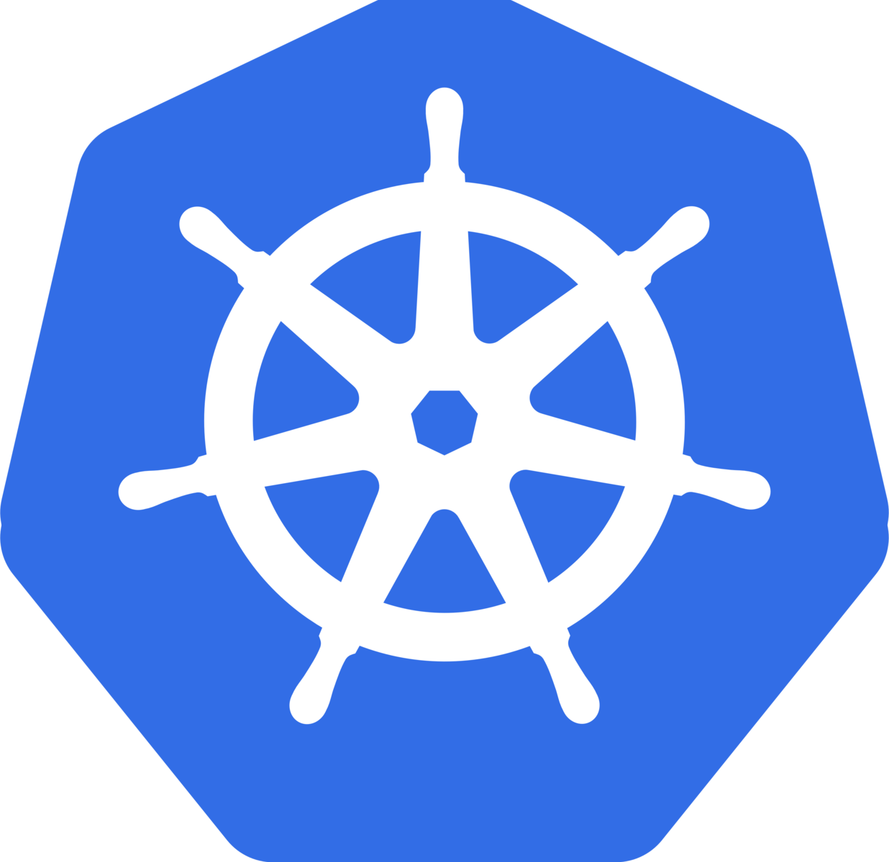

<p align="center">

<br><br>

# Kubernetes - Быстрый старт

Наше видео на [Youtube](https://www.youtube.com/channel/UCqC3c7UHtwoX2wy7fdHc6gg) и новости в [Telegram](https://t.me/devops_mops)
<br><br>

Полезные ссылки для начала работы с [Kubernetes](links.md)

## Установка KiND

KiND (Kubernetes iN Docker) - это кластер Kubernetes, развернутый в Docker, поэтому он должен быть передварительно установлен:

* [Docker](https://docs.docker.com/get-docker/)
* [Go](https://golang.org/doc/install)

Утанавливаем KiND

https://kind.sigs.k8s.io/docs/user/quick-start/#installation

> Если запустить KiND на вашем компьютере не удается, можно использовать сервис Play with Kubernetes
>
> https://labs.play-with-k8s.com/


## Запускаем кластер Kubernetes

> Docker должен быть запущен

> Если у вас уже есть файл kubeconfig сохраните его, иначе он будет перезаписан

Запускаем кластер с одним узлом
(1 Master + Worker)
```
kind create cluster

kubectl cluster-info --context kind-kind
```

Запускаем кластер с несколькими узлами
(1 Master, 2 Workers)
```
kind create cluster --config kind/kind-config.yaml  --name cluster

kubectl cluster-info --context kind-cluster
```

Запускаем отказоустойчивый кластер
(3 Masters, 3 Workers)
```
kind create cluster --config kind/kind-ha-config.yaml  --name cluster-ha

kubectl cluster-info --context kind-clister-ha
```

Показать все кластера Kubernetes, созданные KiND
```
kind get clusters
```

Показать созданные контейнеры Docker
```
docker ps
```

Удалить все кластера, созданные KiND
```
kind delete clusters --all
```

## Исследуем кластер Kubernetes

Показать все ноды кластера
```
kubectl get node
```

Вывести подробную информацию о нодах кластера
```
kubectl get node -o wide
```

Показать все Pod в namespace kube-system
```
kubectl get pod -n kube-system
```

Вывести подробную информацию о Pod в Namespace kube-system
```
kubectl get pod -n kube-system -o wide
```

## Запускаем первое приложение

Создаем Namespace
```
kubectl create ns hpa-test
```

Устанавливаем тестовое приложение
```
kubectl apply -f https://k8s.io/examples/application/php-apache.yaml -n hpa-test
```

Проверяем работу приложения
```
kubectl port-forward service/php-apache 8080:80

curl http://localhost:8080
```

## Проверяем надежность кластера Kubernetes

Удалить все Pod в кластере
```
kubectl delete pod -A --all
```

## Chaos Engineering

Тестируем стабильность кластера Kubernetes с помощью приложения KubeDOOM, убивая монстра удаляем случайный Pod :)

Клонируем репозиторий проекта KubeDOOM
```
git clone https://github.com/storax/kubedoom.git
```

Устанавливаем VNC Viewer

https://www.realvnc.com/en/connect/download/viewer/macos/

Подключаемся к KubeDoom через VNC **localhost:7000**

Включаем Port forward
```
kubectl port-forward deployment/kubedoom 7000:5900 -n kubedoom
```

>Пароль: **idbehold**

>Получить все оружие: **idkfa**

>Убрать стенку справа: **idspispopd**
